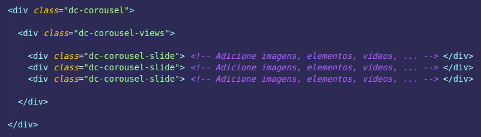

### LIB - Dynamic Carousel

#### Escopo

**Inserção:** Para usar o *DynamicCarousel*, crie um elemento baseado em 3 classes: O elemento pai, que representa a área de visualização do carrossel *(dc-carousel)*, o elemento que irá conter todos os slides *(dc-carousel-slides)* e os slides *(dc-carousel-slide)*. A função irá automaticamente criar um container das setas e dos contadores de sliders, ambos configuráveis.

###

**Manipulação:** É possível modificar o funcionamento do carrossel, passando para função variáveis manipuladoras.

###

#### Variáveis de manipulação

**Formatação geral**

`loop: <valor>` Se ativado, quando clicado para a próxima exibição e não houver mais, retorna para a primeira

**Tempo e Contadores**

`transition_time: <valor>` Configura o tempo que leva para transitar entre exibições
`autoplay: <valor>` Se ativado, define um tempo automático de transição
`autoplay_time: <valor>` Quando autoplay está ativado, define o tempo entre as transições automáticas
`counter: <valor>` Configura para aparecer os contadores de exibições na parte inferior

#### Reports

> A primeira transição não apresenta tempo de transição, posteriormente se normaliza